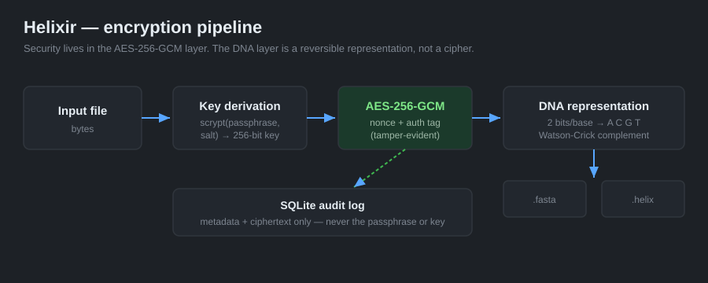

# Helixir 🧬🔐

**Passphrase-based file encryption with a DNA representation layer.**

`Version 1.0 · in active development`


Helixir encrypts any file with a passphrase using **AES-256-GCM** (authenticated
encryption) and a **scrypt** key-derivation function, then renders the resulting
ciphertext as a **DNA nucleotide sequence** (A / C / G / T) that can be exported
as a FASTA record. A PyQt6 desktop app wraps the whole flow, plus an optional —
and clearly labelled — non-secure webcam "visual scramble" preview.



---

## Where the security actually lives

This is the honest part, and the part worth defending:

- **All confidentiality and integrity come from the AES-256-GCM layer.** The key
  is derived from your passphrase with **scrypt** (memory-hard), using a fresh
  random **16-byte salt** and **12-byte nonce** per operation. GCM's
  authentication tag means a **wrong passphrase or any tampering is rejected**,
  not silently mis-decrypted.
- **The DNA layer is representation, not encryption.** Bytes map to nucleotides
  at a fixed 2 bits per base (`00→A, 01→C, 10→G, 11→T`); the optional
  **Watson-Crick complement** (A↔T, G↔C) is a real, reversible base-pairing
  transform. On their own these are trivially reversible — they give the
  ciphertext a genetic representation (and a FASTA export), and add **no**
  security claim of their own.
- **No secret is ever persisted.** The SQLite audit log stores metadata (source
  name and SHA-256, algorithm, salt, nonce) and the already-encrypted container
  — **never the passphrase, the derived key, or the plaintext.**

> Helixir is a from-scratch engineering project built to demonstrate correct use
> of modern authenticated encryption and a clean desktop architecture. It is not
> an audited cryptographic product; use vetted tools for protecting real secrets.

---

## Features

- **AES-256-GCM** authenticated encryption with per-operation salt and nonce.
- **scrypt** password-based key derivation (parameters stored in the container).
- **Self-describing container** (`.helix`): magic, version, KDF parameters, salt,
  nonce and ciphertext in one blob — decryptable later with only the passphrase.
- **DNA codec**: reversible bytes ↔ A/C/G/T, Watson-Crick complement, GC-content,
  and **FASTA** import/export.
- **SQLite audit log** that never stores secrets, with list / decrypt / clear.
- **PyQt6 desktop UI** with a dark theme, DNA preview, and export buttons.
- **Optional webcam visual scramble** — a reversible block shuffle, clearly
  marked non-secure, kept purely as a visual effect.
- **25 unit tests** covering encrypt↔decrypt round trips, tamper detection,
  DNA round trips, complement self-inverse, and "no secret columns" in the log.

---

## Install & run

The core library and tests need only `cryptography`. The desktop app adds PyQt6
and (for the optional webcam tab) OpenCV.

```bash
pip install -r requirements.txt         # core + tests
pip install -r requirements-gui.txt     # desktop app + optional webcam
python run.py                           # launch the GUI
```

Run the test suite:

```bash
pip install -r requirements-dev.txt
pytest -v
```

---

## Using the library

```python
from helixir import crypto, dna_codec

# Encrypt -> DNA
dna, result = crypto.encrypt_to_dna(b"top secret bytes", "a-strong-passphrase")
print(len(dna), "bases,", f"{dna_codec.gc_content(dna):.0%} GC")

# Export as FASTA
open("secret.fasta", "w").write(dna_codec.to_fasta(dna, header="secret"))

# Decrypt
plaintext = crypto.decrypt_from_dna(dna, "a-strong-passphrase")
```

Container format:

```
MAGIC(4) | VERSION(1) | log2(N)(1) | r(1) | p(1) | SALT(16) | NONCE(12) | CIPHERTEXT+TAG
```

---

## Project structure

```
helixir/
├── helixir/
│   ├── crypto.py        # AES-256-GCM + scrypt, self-describing container, DNA pipeline
│   ├── dna_codec.py     # bytes <-> ACGT, Watson-Crick complement, FASTA, GC-content
│   ├── storage.py       # SQLite audit log (metadata + ciphertext only)
│   ├── scramble.py      # optional NON-SECURE webcam block shuffle (visual effect)
│   └── gui.py           # PyQt6 desktop interface
├── tests/               # 25 unit tests (crypto, dna_codec, storage, scramble)
├── docs/images/architecture.svg
├── .github/workflows/ci.yml   # ruff + pytest on Python 3.10 / 3.11 / 3.12
├── requirements.txt / -gui.txt / -dev.txt
├── run.py
├── LICENSE
└── README.md
```

---

## Testing & CI

The security-critical logic is unit-tested: encryption round trips across empty
and large inputs, **wrong-passphrase and tampered-container rejection** (both
ciphertext and authenticated header), DNA encode/decode round trips, the
complement being self-inverse, and a schema check proving the audit log has **no
key/passphrase/plaintext column**. GitHub Actions runs `ruff` and `pytest` on
Python 3.10–3.12 on every push.

---

## Author

Built by **Nisa Maaşoğlu**, Software Engineer — [github.com/nisamaasoglu](https://github.com/nisamaasoglu).
Source code available on request.

Licensed under the [MIT License](LICENSE).
